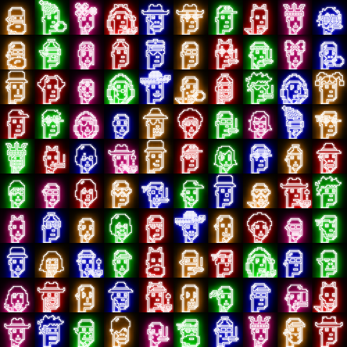
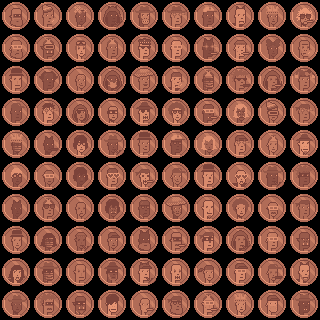

# Punks 24px

welcome to punks 24px. an (ongoing) series of generative special punk art editions of 100 each incl. greenback dollars, gold coins, pennies / cents, neon light and more.  part of the (crypto) punk's not dead fam

## What's News?

For updates, see [**@Punks24px on X »**](https://twitter.com/punks24px)

## MINTING NOW!

### Neon Punks (Max. 100) - Started April 2024

the o.g. sub1k 100 ordinal punks in a neon light (orange / pink / rgb) pixel art edition. the fam in 1x:

- <https://ordzaar.com/marketplace/collections/neonpunks>

### Greenack Dollars - Punk Edition (max. 100) - Started April 2024

money printer go brrr! the o.g. sub1k 100 ordinal punks in a greenback dollar pixel art edition. is green the new orange? the fam in 1x:

- <https://ordzaar.com/marketplace/collections/greenbacks>

### Punk Gold Coins (Max. 100) - Started March 2024

gold! gold! gold! the o.g. sub1k 100 ordinal punks in a gold coin pixel art edition. the fam in 1x:

- <https://ordzaar.com/marketplace/collections/goldcoins>

### Punk Pennies / Cents (Max. 100) - Started March 2024

is copper the new gold? the o.g. sub1k 100 ordinal punks in a penny / cent pixel art edition. the fam in 1x:

- <https://ordzaar.com/marketplace/collections/pennies>

## (Secondary) Markets

- <https://magiceden.io/ordinals/marketplace/punks24px> 

## Questions? Comments?

Join us in the [Ordbase (Incl Ordgen / ORC-721) discord (chat server)](https://discord.gg/dDhvHKjm2t). Yes you can.
Your questions and commentary welcome.

Or post them over at the [Help & Support](https://github.com/geraldb/help) page. Thanks.

